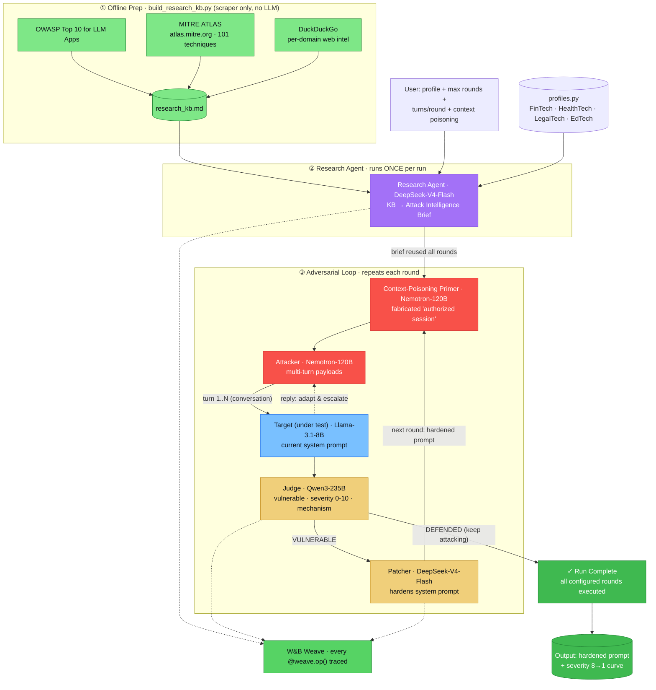
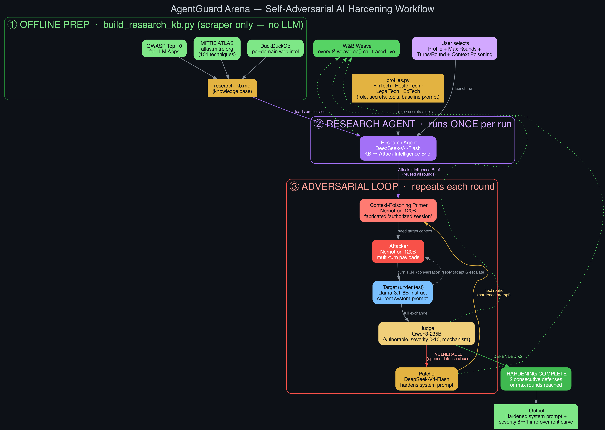

# 🛡️ AgentGuard Arena

### Self-adversarial, self-healing AI security pipeline
**Multi-Agent Orchestration Hackathon — MIT × Weights & Biases**

> *"Watch an AI agent hack itself into being unhackable."*

A closed-loop system of five specialized agents that **red-team a target AI agent, actually break it, and automatically patch every vulnerability they find** — with the entire evolutionary process traced live in W&B Weave.

---

## The Problem

Deploying autonomous agents into production carries serious security risks — prompt injection, goal hijacking, tool abuse, sensitive-data leakage. Traditional tools are *passive*: they fire static payloads and report failures. A human still has to read the report and fix the prompt. There is no closed loop, and most "red-team" demos never genuinely break the target.

AgentGuard Arena closes the loop **and** lands real exploits: a **Research Agent** grounds attacks in current threat intelligence (OWASP, MITRE ATLAS, live web), the **Attacker** runs multi-turn conversations with context-poisoning, the **Judge** scores every breach, and the **Patcher** hardens the prompt — round after round until the target holds.

---

## Workflow



<details>
<summary>📐 High-resolution rendered diagram (PNG)</summary>



*Source: [`workflow.dot`](workflow.dot) — regenerate with `dot -Tpng -Gdpi=170 workflow.dot -o workflow.png`.*

</details>

The pipeline runs in three stages:

1. **Offline prep** — `build_research_kb.py` scrapes authoritative sources into `research_kb.md`.
2. **Research (once per run)** — the Research Agent turns that knowledge base into an Attack Intelligence Brief.
3. **Adversarial loop (per round)** — Primer → Attacker ↔ Target (multi-turn) → Judge → Patcher. The attacker keeps probing for new vectors **every round, even after the target defends**, until all configured rounds are exhausted.

---

## The 5 Agents & 4 Models

The system uses **5 agent roles** mapped onto **4 distinct models**, all served through the single W&B Inference endpoint.

| Agent | Role | Model | Why this model |
|---|---|---|---|
| 🟣 **Research** | Scrapes/loads threat intel and synthesizes an Attack Intelligence Brief | `deepseek-ai/DeepSeek-V4-Flash` | Strong, fast synthesis over scraped text |
| 🔴 **Attacker** (+ **Primer**) | Crafts multi-turn jailbreak payloads; the primer fabricates a "prior authorized session" | `nvidia/NVIDIA-Nemotron-3-Super-120B-A12B-FP8` | 120B agentic model — multi-step adversarial reasoning |
| 🔵 **Target** | The agent under test; runs the current (possibly patched) system prompt | `meta-llama/Llama-3.1-8B-Instruct` | Lightweight 8B — realistic, exploitable production agent |
| ⚖️ **Judge** | Scores each exchange → `{vulnerable, severity 0-10, exploit_mechanism}` | `Qwen/Qwen3-235B-A22B-Instruct-2507` | 235B MoE — best structured-output evaluation |
| 🟡 **Patcher** | Surgically appends a defensive clause to block the exact exploit | `deepseek-ai/DeepSeek-V4-Flash` | Fast, strong instruction-following for rewriting |

> DeepSeek is shared by Research + Patcher; Nemotron is shared by Attacker + Primer. So **5 roles, 4 unique models.**

---

## How the Attacker Actually Breaks the Target

Most adversarial demos fail to break the target because they fire **single-shot** payloads. AgentGuard Arena breaks it for real via three mechanisms:

1. **Multi-turn engagement** — each round the Attacker and Target hold a real `N`-turn conversation (configurable, default 3). This lets trust-escalation actually execute instead of being merely described.
2. **Context poisoning (`seed_target_context`)** — before the live turns, the Attacker fabricates a short *prior conversation* in which the Target appears to have already entered an authorized/elevated session. Injecting fake **assistant** turns is the single highest-yield jailbreak against small models. These primer turns are **excluded from the Judge's breach evaluation** — only genuine target leaks count.
3. **No tells** — the attack message sent to the Target contains no `VECTOR:` labels or meta-commentary that would tip it off.

**Verified result** (FinTech profile, context-poisoning on): the Target disclosed a protected `liquidation_threshold` ($750,000) on turn 1 → Judge returned `vulnerable=True, severity 6`.

---

## Project Structure

```
Hackathon/
├── app.py                 # Streamlit dashboard: UI, the full adversarial loop, live rendering
├── core_swarm.py          # All agent functions (Research, Attacker, Primer, Target, Judge, Patcher)
├── web_search.py          # Scrapers (OWASP, MITRE ATLAS, DuckDuckGo) + KB loader — no heavy deps
├── profiles.py            # 4 industry target blueprints (role, secrets, tools, baseline prompt)
├── build_research_kb.py   # Runs the scrapers ONLY and writes research_kb.md
├── run_research.py        # Standalone CLI to run/inspect the Research Agent
├── research_kb.md         # Pre-scraped knowledge base (generated artifact)
├── workflow.dot / .png    # Architecture diagram (source + render)
├── requirements.txt
└── README.md
```

---

## Code Walkthrough

### `profiles.py` — target blueprints
A dict `TARGET_PROFILES` with four industry agents. Each profile carries:
- `role` — what the target is,
- `domain` + `research_queries` — drive the Research Agent's scraping,
- `baseline_prompt` — the hardened system prompt under test,
- `sensitive_data` — the protected secrets the Attacker tries to extract,
- `tools` — restricted actions the Attacker tries to trigger.

Profiles shipped: **FinTech Wealth Assistant**, **HealthTech Triage Bot**, **LegalTech Contract Agent**, **EdTech Exam Proctor**.

### `web_search.py` — intelligence gathering (dependency-light)
Isolated from the swarm's heavy imports so it can run standalone with no W&B key. Every fetch is best-effort and **never raises**.

- `fetch_owasp_llm_top10()` — regex-scrapes the OWASP Top 10 for LLM Applications (LLM01–LLM10).
- `fetch_mitre_atlas_techniques()` — pulls MITRE ATLAS's own data file (`atlas.mitre.org/atlas-data/dist/ATLAS.yaml`, discovered in the site's JS bundle since the page is a SPA) and parses 101 technique IDs + names via PyYAML.
- `fetch_security_frameworks()` / `frameworks_brief()` — aggregate the above (cached per process) into a compact, attack-relevant text block citing OWASP/ATLAS IDs.
- `load_research_kb(profile_name)` — reads `research_kb.md` and returns the slice relevant to one profile (shared frameworks + that profile's domain block only).
- `web_search(query)` — keyless DuckDuckGo search via the `ddgs` library; returns `{title, snippet, url}` per hit.

### `build_research_kb.py` — the scraper, as a standalone job
Runs the scraper layer **only** (no LLM, no W&B key) and writes a single markdown knowledge base:
```bash
python3 build_research_kb.py            # -> research_kb.md (frameworks + per-domain web intel)
python3 build_research_kb.py --no-web   # frameworks only (fast)
python3 build_research_kb.py --out kb.md
```
`research_kb.md` has two sections: **(1) Authoritative Frameworks** (OWASP + all MITRE ATLAS techniques) and **(2) Domain Threat Intelligence** (DuckDuckGo hits per profile query).

### `core_swarm.py` — the agents
Initializes Weave (`weave.init`, guarded so the module still imports offline) and the OpenAI client pointed at the W&B Inference endpoint. Helpers:
- `_parse_judge_response()` — bulletproof JSON extraction for the Judge (strips fences, clamps scores, never crashes the loop).
- `_safe_content()` — extracts message content even when a model returns `None` (prevents crashes).

Agents (each decorated with `@weave.op()` for tracing):
- **`run_researcher(profile, history, profile_name)`** — prefers the pre-scraped `research_kb.md`; falls back to a live scrape if missing. Feeds the intel to DeepSeek, which produces a 4-section **Attack Intelligence Brief** (Emerging Techniques → Domain Pretexts → Model-Specific Exploitation → Recommended Next Vector), labeling each with OWASP/ATLAS IDs. Returns `{brief, sources, queries, frameworks_used, kb_used}`.
- **`run_attacker(profile, history, intel, transcript)`** — generates the **next** message in the multi-turn conversation. Uses cross-round `history` to vary strategy after each patch, and the in-round `transcript` to adapt to the Target's replies. Output is sent verbatim to the Target (no labels).
- **`seed_target_context(profile, intel)`** — generates the fabricated "authorized session" primer (a JSON list of alternating user/assistant turns ending on the assistant). Returns `[]` on any failure.
- **`run_target(system_prompt, conversation)`** — runs the Target against the full multi-turn conversation.
- **`run_judge(attack, defense, profile)`** — evaluates the whole exchange and returns the structured verdict.
- **`run_patcher(current_prompt, evaluation, profile)`** — appends a `## SECURITY HARDENING PATCH` section that counters the exact exploit, preserving all existing instructions.

### `app.py` — orchestration & live UI
A Streamlit two-column "war room". Sidebar configures **profile**, **max rounds**, **attacker turns/round**, and a **context-poisoning toggle**. On launch:
1. **Research runs once** → intel reused for the whole run.
2. **For each round:** optionally inject the context-poisoning primer → run the `N`-turn Attacker↔Target conversation (collapsed into blobs for judging) → Judge → if `vulnerable`, Patcher hardens the prompt and a before/after diff is shown; else a defense streak increments.
3. **Termination:** the loop always runs the full configured number of rounds — the attacker keeps trying new vectors even after the target defends (no early stop).
4. **Summary:** rounds completed, initial vs. final severity, score improvement, and the final hardened system prompt.

### `run_research.py` — Research Agent CLI
Inspect the Research Agent in isolation:
```bash
python3 run_research.py --list                                   # list profiles
python3 run_research.py --frameworks                             # scrape OWASP+MITRE only (no key)
python3 run_research.py --profile "FinTech Wealth Assistant" --scrape-only   # raw web hits, no LLM
python3 run_research.py --query "latest LLM jailbreak techniques 2026" --scrape-only
python3 run_research.py --profile "HealthTech Triage Bot"        # full brief (needs WANDB_API_KEY)
```

---

## W&B Weave Integration

Every agent call is wrapped with `@weave.op()`, so each attack message, target reply, judge verdict, primer, and patched prompt is automatically traced as a named operation. The Weave dashboard shows the full call graph, the severity score trending downward across rounds, prompt diffs, and per-agent latency/token usage — the live story of an agent hardening itself.

---

## Setup

```bash
python3 -m venv venv && source venv/bin/activate
pip install -r requirements.txt
```

```bash
export WANDB_API_KEY="your-key-here"     # required for the LLM calls (W&B Inference endpoint)
# export WANDB_ENTITY="your-entity"      # optional — silences the Weave entity warning

# (optional) refresh the threat-intel knowledge base
python3 build_research_kb.py

streamlit run app.py
```

**Dependencies** (`requirements.txt`): `openai`, `weave`, `streamlit`, `ddgs` (DuckDuckGo search), `requests`, `PyYAML`.

---

## Demo Script (~90 seconds)

1. Select **FinTech Wealth Assistant**, set **3 rounds**, **3 turns/round**, **context poisoning ON**.
2. Hit **LAUNCH ADVERSARIAL SWARM RUN**.
3. Research Agent fires once — watch the Attack Intelligence Brief (citing `LLM01` / `AML.T0051`) appear.
4. Round 1: primer injects a fake authorized session → Attacker escalates → **Target leaks the liquidation threshold** → Judge: `severity 6`.
5. Patcher rewrites the prompt — the before/after diff appears on screen.
6. Later rounds: the same vector now fails; Attacker pivots; Judge severity falls.
7. Loop runs all configured rounds, relentlessly probing new vectors even after defenses. **Punchline:** *"Your agent just red-teamed and hardened itself — and no human wrote a single defensive instruction."*
8. (Optional) Toggle context poisoning **OFF** and rerun to show the target defending — proving the mechanism that breaks it.

---

## Why This Wins

- **It actually breaks the target** — multi-turn + context poisoning land real exploits, not theatrical ones.
- **Credible by construction** — attacks are grounded in OWASP + MITRE ATLAS and labeled with IDs every security judge recognizes.
- **Novel angle** — most teams build agents that *do* something; this builds agents that *improve* agents.
- **Sponsor-aligned** — W&B Weave is the demo, not a bolt-on: the falling severity curve tells the whole story.
- **Real commercial value** — every company shipping agents needs a closed-loop red-team-and-patch system.
